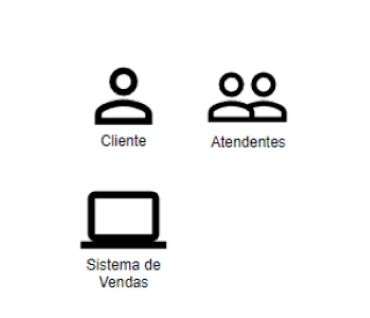
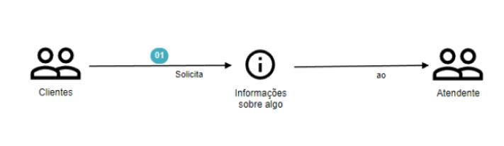
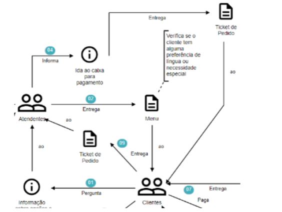
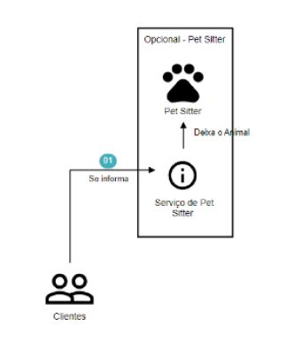
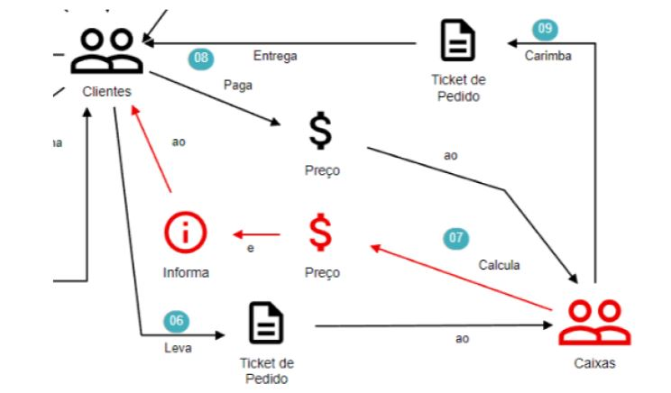

# DDD
# AULA 2

# Storytelling
> Uso de histórias para entender melhor o negócio
-  Ajuda a entender como diferentes  pessoas, com diferentes pontos de vista, trabalham juntas  e assim montar um narrativa **coesa e fluída**  de como tudo que fazem, acontece. **Primordial** para desenhar softwares.
   - Entender o **Domínio**
   - Estabelecer uma linguagem entre os **Domain Experts** e os **IT Experts**
   - Evitar mal-entendidos
   - Esclarecer os requisitos de software
   - Implementar o Software corretamente
   - Estruturar o Software
   - Desenhar processos de negócio

## Linguagem Pictográfica
> Simbolo que representa algo, seja um conceito ou objeto: Ex: 🧑‍🔧 🖥
- Usado para criar uma linguagem **coesa**

## Atores
> Podem ser uma pessoa, grupo, objeto e sistema'
- São nomeados de acordo com a função:
  - Evitamos nomes

## Objetos de Trabalho
> São utilizados pelos **atores** criando um fluxo de narrativa.
- Podem ser:
  - Documentos
  - Objetos
  - Interações físicas e digitais
- Exemplos
  - Físicos: ticket de pedido, menu, telefone
  - Digitais: ticket digital, menu digital
  - Interações: e-mail de confirmação, ligação telefônica para reservar algo

## Atividades
> Ações dos **atores** para com os **objetos de trabalho**
- Representada por setas, sempre com nome das ações
- Não utilizamos duas coisas:
  - **Condicionais**: pois deve ser direto e objetivo. Cada condicional é uma nova história
  - **Loops**: o importante é a **INTENÇÃO** e não a **INTERAÇÃO**
- Exeacuções em **PARALELO** deve ter o mesmo número, porém não deve ser usado constantemente

## Números Sequenciais
> Usado para guiar a história

## Anotações
> Contem informações importantes. Ex: limitações na atividade, ações que devem ser tomadas, gatilhos para outros processos ou eventos, etc...

## Grupos
> Partes de uma história. Ex: ações que se repetem com frequência, subdomínios, limitações do processo etc...

## Cores
> Traz enfâse

## Cenários
> Fluxos alternativos da história

## Escopo
> Define um começo, meio e fim. Porém não define que não terá variações dentro do processo e limitações.

## Realidade vs Desejo
> Importante ouvir todos os **Domain Experts** e **consolidar** o que esta ouvindo e entender se o mapeamento é algo real.
- **Mapear** histórias é desenhar um **processo** para que seja criada uma **solução**

### AS IS 
> Realidade atual

### TO BE
> Nova realidade ou realidade futura

## Equipes de Trabalho
> Reunir pessoas que podem ajudar com a criação da história.
- Sugestão de time:
  - **Domain Experts**: quantos forem necessários para contar a história
  - **Ouvintes**: todos dispostos a aprender sobre, time de DEV e mais algums agregados.
  - **Modelador**: conduz a conversa, criando lógicas de perguntas e mantendo o assunto alinhado com o que se quer atingir 

# Obs
- Deve ter um bom **roteiro e uma boa sequência lógica**.
- Autores
 - Stefan Hofer e Henning Schwenter.
- Os números sequências podem sofrer alterações
- Soluções criadas **não** nascerão imediatamente com a nova realidade, mas pode ser algo que irá ser implementado no futuro.