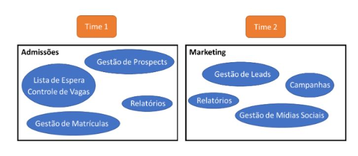

# DDD
# Aula 3

# Descoberta e formação do conhecimento
> Como identificar o desafio do negócio, entender o problema e criar uma **linguagem única** para comunicar com o negócio.

## O Desafio do negócio
> O que o negócio faz, quais são os seus processos e desafios conhecidos.

## Linguagen Ubíqua
> Termos utilizado em cada negócio
- Devem ser bem claros para cada **cenário** e **subdomínio**. Dessa forma tanto o negócio quanto os DEVS falam a mesma lingua.

### Termos Ambíguos
> Dentro de um **subdomínio**, pode ter um *mesmo termo* com *vários* significados.

### Termos Sinônimos
> Dentro de um **subdomínio**, pode ter um **termo** que é utilizado para **vários** significados quepossuem muito mais detalhes. Ex: Login

## Modelagem do Domínio
> Desenho de uma abstração de um processo do qual queremos resolver um problema

## Ferramentas
- Exemplos de como montar uma wiki:
  - Wiki para ser a central do projeto, consolidando todos os **recursos**
  - Seção na Wiki com a **descrição** do projeto
  - Seção na Wiki com o **time** do projeto. Uma página para **cada subdomínio**
  - Seção na Wiki para a **linguagem ubíqua** (DICIONÁRIO)
  - Seção na Wiki para os **cenários**, suas premissas e limitações
  - Link para um **repositório** no Github
  - Link para a **Ferramenta** de Gestão do Projeto

## Contexto Delimitados (Bounded Contexts)
>  Limites da solução existentes dentro do contexto ao analisar o negócio.
- **Não** a regra pra definir o tamanho de um contexto delimitado, tudo depende da **análise do arquiteto**. Se a terminologia é a mesma em dois contextos e tratam os processos de negócio de formas **muito parecidas**, pode ser uma boa ideia **juntar** as duas no **mesmo contexto**, ou até mesmo o contrário; se forem **muito distintas**, **separe-os** para que possam ser implementados sem interferência.
- A quantidade de recursos **não** é fixa. Não é porque o contexto é grande demais que você precisa de um time imenso. Pode ter muito dependência dessa forma o paralelismo não irá acelerar o processo.
- O número de contextos pode mostrar o número de times que farão parte da equipe de desenvolvimento. Mas podemos sempre refinar o contexto para diminuir essa quantidade.
- Com soluções **pequenas** pode existir contextos que englobam tudo.
- Em soluções **grandes e complexos** pode exitis contextos de 1 para 1.
> Um contexto delimitado é **sempre** trabalhado por **um time**, **NUNCA** **compartilhado entre dois**, mas **um time** pode trabalhar em **diversos contextos**

# OBS
- Em uma conversa com o **Domain Expert** temos uma visão dos **problemas** enfrentados pelo negócio.
- É importante **DOCUMENTAR** os modelos e menter um dicionário de **linguagem ubíqua**