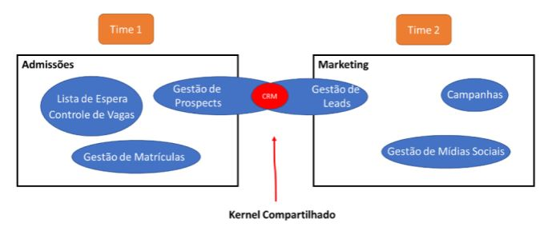

# DDD
# Aula 4

# Trabalhando com contextos delimitados
> Deixa bem claro cada parte que queremos construir. Cada um tem sua **linguagem própria**.
- O negócio não vive por conta de um único contexto, e sim de vários e de suas **integrações**.
- Cada **contexto delimitado** será feito por um time ao mesmo tempo, tem que ter disciplina, pois é a parte **chave** de todo o processo de negócios.

## Cooperação
> Comunicação é **clara e objetiva** entre os **times** e *NÃO* existe precedência de um **contexto** a outro. **Colaboração total** entre os times.

## Parceria
> Comunicação flui constatemente e os times se **notificam** sobre mudanças, dando **tempo** e **documentação** ao outro time de forma que adapte seu **contexto** para se manter conectado.
- Forma de integração
- Linguagem dendo utilizada
- Tempo de resposta das adequações, etc..

## Kernal Compartilhado
> Uma parte do modelo é **comum** a **todos** os **contextos** envolvidos e deve seguir a definição de dados para que funcione.

- A **comunicação** tem que ser essencial, pois fere todos os principios dos contextos delimitados.
- **É desafiador** pois envolve compartilhar o mesmo código com todos os times envolvidos. **NÃO RECOMENDADO**
- Se aplicado deve ser **analisado** e **coordenado** com muita *atenção*, **evitando perda de dados** ou **problema de execução**
- Em sistemas **legados** o uso é **inevitável** até mordenizar o sistema.

## Cliente-Fornecedor
> Times desenvolvem os **contextos** **separadamente**, porém **possui** alguma **dependência** por conta de um servíço. Cenário no qual os times podem **não se entenderem** quanto à integração, **possuem poder** de **decidir** como querem se **integrar**.
- **Fornecedor(Upstream)**: provê um serviço
- **Cliente(Downstream)**: consome um serviço

## Conformista
> Utilizar sistemas de terceiros, temos que nos conformar com as regras definidas pelo **fornecedor**, adquando nosso sistema para trabalhar com um padrão fornecido.

a
## Camada Anticorrupção (Anti-Corruption Layer) ACL
> Cria camada para abstrair implementações entre protocolos **NÃO CONFORMISTAS**

 
 

- Quando é recomendado o ACL?
  - Contexto Cliente(D) contém um **subdomínio principal**. Evita que se corrompa ou interfira no implementação da solução **principal**, isolando o código.
  - Modelo do Fornecedor(U) é **ineficiente** ou **não** serve totalmente oa cliente. Criamos **ACL** para **filtrar** somente o que é necessário. *Muito usada em legados*
  - Fornecedor(U) **muda constantemente** seu protocolo, o que **aumenta a complexidade da solução**. Com **ACL** a manutenção fica apenas nesse código.

## Serviço de Host Aberto (Open-Host Service) - OHS
> **Fornecedor(U)** provê uma **camada de integração** onde expõe seus **serviços** para que o **Cliente(D)** *NÃO* precise se adaptar, mas sim usar algo **padronizado** que *não* muda durante o tempo.
- **Fornecedor(D)** separa seu desenvolvimento **interno** do que é **publicado** aos **Clientes(D)**, uando um **protocolo imutável e aberto**
- Usada pelo **Cliente(D)** *OU* **Fornecedor**

## Linguagem Publicada (Published Language)
> Além do **OHS**, pois além de **publicar o protocolo** o **Fornecedor(D)** pode criar uma abstração a mais, que é a linguagem utilizada pelo **Cliente(D)**.

- **Fornecedor(U)** possui soluções **internas** sem afetar os **Clientes(D)** e mantém diversas *versões personalizadas* de linguagem, **um para cada cliente**. Mantendo o seu **protocolo aberto**
  - Ex:
    - Mercado Financeiro: Cielo, Stone, Cartão de Crédito
    - Mercado Logistico: Transportes, controle de estoque.
    - Mercado de manufatura: Integração com diversos fornecedores, padronização de protocolos

## Caminhos Separados
> Times **não** se **integrão**, *sem possibilidade** de comunicação, **custo de integração** *muito maior* do que criar a solução interna, e não tem sentido em expor o serviço ao outros contextos.

- Podem acontecer em:
  - Sistema de Relatórios
  - Sistema de Autenticação
  - Sistema de Log

## Grande Bola de Lama
> Encontrado em sistemas muito grandes, sem contextos bem definidos e inconsistentes, nesse caso a recomendações seriam:
- Desenhe uma linha de limite em torno e chame de **Grande Bola de Lama**
- Não tente aplicar método sofisticado de modelagem
- Cuidado, pode contaminar outros contextos

## Mapa de Contexto
> Visual dos **contextos delimitados** e como elas se **integrão**. Dessa forma temos a *visão estratégica* do todo.
- Documento vivo
- Deve ser atualizado constantemente

# OBS
- Na **parceria** a comunicação é muito frequente e mudanças serão normais, principalmente nos primeiros momentos do desenvolvimento.