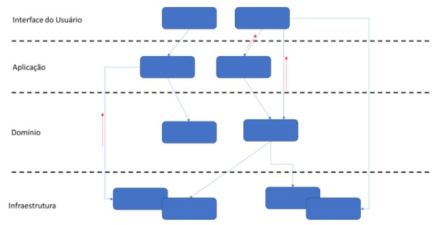
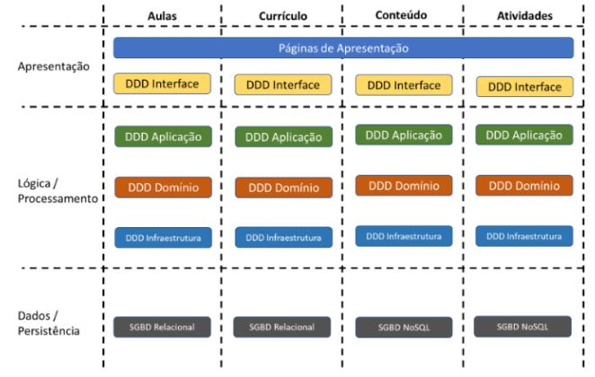

# DDD
# Implementando arquitetura e lógica

## O Design Tático
> Define o **como** fazer e quais tecnologias usar.

## Arquitetura
> Como cada subdomínio será implementado, onde ficarão as lógicas.
- **DDD** organiza sua arquitetura em quatro(4) partes
  - Camada de interface de usuário
  - Camada de aplicação
  - Camada de domínio
  - Camada de infraestrutura

### Camada de interface de usuário
> Contem o (**GUI**), interface de linha de comando (**CLI**) e **APIs** para integração com outros sistemas.

### Camada de Aplicação
> **Interfaces** que fazem a mediação entre a **camada de interface do usuário** e a **camada de dominio**
- **NÃO** contém **lógica de negócio**
- **NÃO** altera o **estado de objetos** mas **monitora e reporta essas mudanças a camada superior.
- *PODE* **NÃO** exitir, ficando junto a **camada de interface do usuário**
- Podemos definir os **gatilhos**

### Camada de Domínio
> *Coração do software*, possui **TODA A LÓGICA** do negócio.
- Altera o **estado de objetos**

### Camada de Infraestrutura
> Capacidades técnicas de suporte às camadas anteriores
- Meios de mensageria
- Persistêcia de dados
- Padrões de interações entre as camadas.

## Objetos de Valor (Value Objects)
> **NÃO** possuem indicadores, usando o seu valor para serem diferenciados. **Único e imutável**
- Mensuram, quantificam, ou descrevem algo no domínio
- Imutáveis
  - Garante a **UNICIDADE**
- São completamente substituíveis quando uma medida ou descrição muda.
- Comparados por meio da igualdade de valores
- Criam modelo conceitual de integridade se compondo de todos os atributos como uma unidade.

## Entidades (Entities)
> **Possuem identificadores** e **SÃO MUTÁVEIS**
- Possui **ID único**
- Pode e **DEVE** ser alterada depois de criada.

## Agregados (Aggregate)
> Conjunto de **entidades** e **objetos de valor** que mantém **relacionamentos** entre sí e possui um limite que o circunda e define.
- Premissas básicas: **Consistência forçada**, que garante a integridade dos dados. **Somente a lógica do agregado pode alterar o seu estado**, *garantindo que a lógica de negócio que o define seja garantida*
- **NENHUM** objeto **fora do agregado** pode **alterar** o seu estado. Pode **ler**.
- Entidades externas podem solicitar que o agregado  execute ações que alterem seu estado.

## Serviços de Domínio (Domain Services)
> Objetos tratados separadamente, e que trabalham **diversas entidades e agregados**, sempre que são necessários cálculos, execuções de rotinas e muito mais.