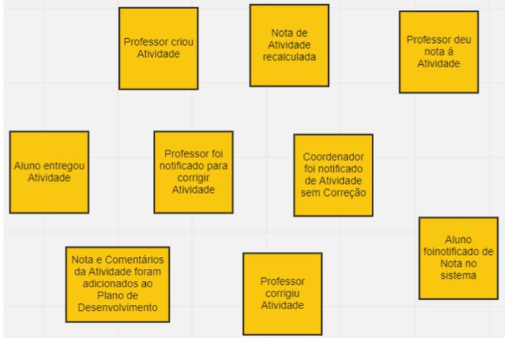
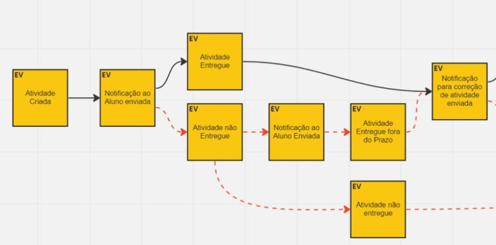
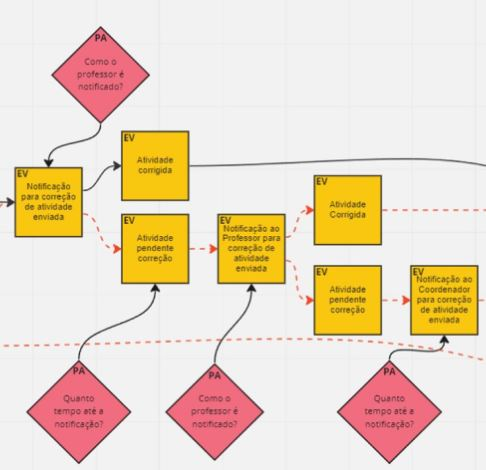
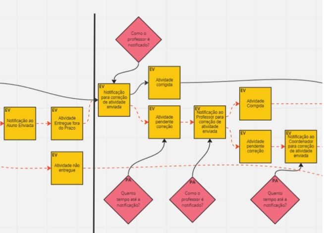
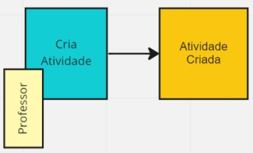
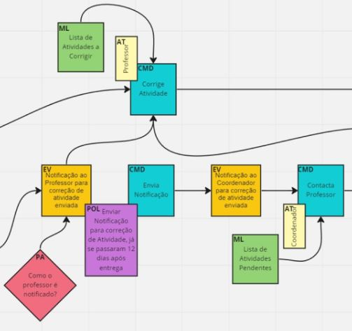
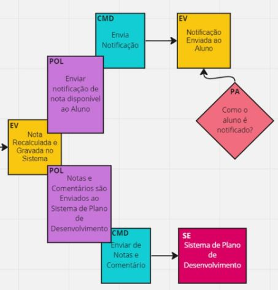
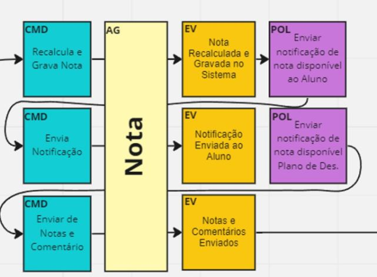

# DDD
# Event Storming

# O que é e por que utilizar?
> É uma atividade lúcida, um grupo modela o processo do negócio. Compartilhando o conhecimento do negócio.
- Essas grupo poder conter pessoas como:
  - **Domain experts**
  - **Ouvintes**
  - **Facilitador**
- Pode ser usado postits, **Miro** ou **FigJam**.

## Brainstoming
> Relatos dos **eventos** do domínio. **Evento** é **algo que ocorreu no domínio uma ação**.
- Deve-se usar **verbos no passado**
  - Criou
  - Anotou

## Linhas do Tempo
> Desenho do **caminho ideal**. *Exceções* devem ser tratadas, podemos **adicionar cenários** e **eliminar duplicidades** do passo de **brainstoming**, corrigir algo que não ficou claro ou adicinar novos eventos.

## Pontos de Atenção
> Assim que tiver uma visão do negócio, podemos começar a **criticar**, adicionar **pontos de atenção**, **dúvidas** sobre cada passo, como e o que é feito, de precisam de mais documentos ou se temos **gargalo**
- Participantes vão contribuir com udo que têm de opniões sobre o processom, problema, preocupação ou dúvida.

## Eventos pivotais
> Eventos que indicam **troca de fase** ou **mudança de contexto**
- São importantes indicadores de **contextos delimitados**

## Comandos
> Ações realizadas por um **ator**.
- Deve-se usar o **imperativo**
  - Criar Atividade
  - Gravar Nota
- Atores aparecem do lado dos comandos
  - **NEM** todo **comando** tem **ator**, pois podem ser realizados por **regras no sistema**

## Políticas
> Comandos que **não possue ator**, disparados por **automações** do sistema que gerão eventos.
- São conectadas a **eventos** que as ativam. Pode ser condicionada à um critério limitante, *uma política só é ativada se, no evento anterior, uma certa condição for cumprida*.

## Modelos de Leitura
> Visão de **dados**, podem ser **relatórios, telas, emails, notificações,etc**, que os **atores** utilizam para tomar **decisão** ants de executar um **comando**

## Sistemas Externos
> Algo além do que estamos desenvolvendo, além do **domínio** explorado.

## Agregados
> Organizar os **comandos** e **eventos** que produzem em **agregados**
- Identificamos quem é o **objeto principal** de cada passo.

## Contextos Delimitados
> Combinar os **agregados** que possuem conexão forte entre sí, sejam por **políticas** ou **eventos relacionados**