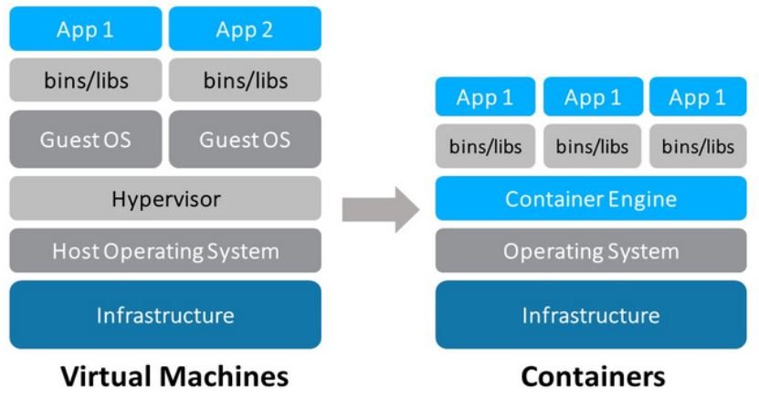

# Dockerização
# Docker
> Sistema para desenvolvimento, distribuição ou execução de aplicações. Possui recursos que ajudam a separar a aplicação da infraestrutura, utilizando o conceito de virtualização.
- **Docker** utiliza o conceito de **container**, compartilhando o **kernel** do sistema operacional.
- São mais leves, pois não usa um S.O completo.

### Client
> Interação com o docker, iniciar, parar um container via linha de comando.

### Server
> Ambiente completo para executar os containers, imagens, rede, volumes e o daemon, que é responsável por todas as ações com o container, recebendo os comandos do client

### Registry
> Define um repositório de imagens usada pelo container. Padrão é o docker hub.

## Comandos
- Básicos:
  - `docker version` - Mostra a versão do docker.
  - `docker ps` - Lista containers em execução
    - `-a` - Parados
  - `docker stop` -  Para containers em execução
  - `docker rm #id` -  Apaga um container